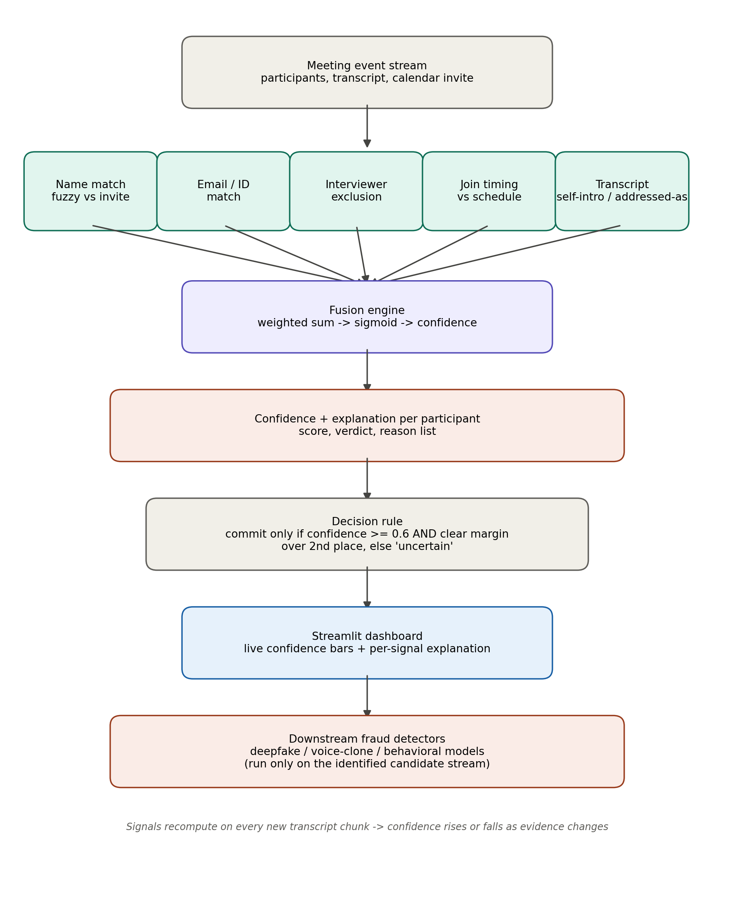

<div align="center">

# 🕵️ Sherlock — Real-time Interview Candidate Identification

**Who's actually the candidate?** Not the display name. Not what the interviewer typed.
A confidence score, fused from evidence, that updates as the meeting happens.


</div>

---

## The problem in one line

The calendar invite tells you the candidate's *name*. It doesn't tell you *which
tile in the meeting is them* — they might join as **"MacBook Pro"**, under a
nickname, or get misnamed out loud by the interviewer. Sherlock treats this as
an **inference problem under uncertainty**, not a lookup.

<div align="center">

</div>

---

## 📋 Table of contents

- [Quick start](#-quick-start)
- [How it works](#-how-it-works)
- [Why fusion, not a single classifier](#%EF%B8%8F-why-fusion-not-a-single-classifier)
- [Assumptions](#-assumptions)
- [Evaluation](#-evaluation)
- [What I'd improve next](#-what-id-improve-next)
- [Repo structure](#-repo-structure)

---

## 🚀 Quick start

```bash
pip install -r requirements.txt
streamlit run src/app.py
```

Open the local URL Streamlit prints. Drag the slider to simulate the meeting
progressing turn-by-turn and watch confidence update **live**.

<details>
<summary>Run the scoring logic headlessly (for tests / CI)</summary>

```bash
python3 -c "
import json
from src.fusion import score_meeting, pick_candidate
meeting = json.load(open('data/mock_meeting.json'))
print(score_meeting(meeting))
"
```

</details>

---

## 🧩 How it works

Seven independent, individually-fallible signals are fused into one confidence
score — no single rule is ever trusted alone.

| Signal | What it checks | Why it's *weak* alone |
|---|---|---|
| `name_match` | Fuzzy match vs. invite name | Fails instantly on "MacBook Pro" |
| `email_match` | Participant email vs. candidate email on file | Email is often not visible |
| `interviewer_exclusion` | Rules **out** known interviewers | Only works if we know interviewer names |
| `join_timing` | Join time vs. scheduled start | Interviewers sometimes join late too |
| `transcript_self_identification` | Did they say *"I'm \<name\>"*? | Only fires once they've spoken |
| `transcript_addressed_as` | Did someone else call them by that name and they responded? | Depends on interviewer phrasing |
| `screen_share_context` | Shared screen right after a technical question | Interviewers share screens too |

```
Meeting event stream (participants, transcript, calendar invite)
        │
        ▼
seven weak-signal extractors  →  src/signals.py
        │
        ▼
fusion engine  →  weighted sum → sigmoid → confidence ∈ [0, 1]
                   recomputed from scratch on every new transcript
                   chunk, so confidence can rise OR fall
        │
        ▼
decision layer  →  commits only if confidence ≥ 0.6 AND a clear
                    margin over 2nd place — otherwise: "uncertain"
        │
        ▼
Streamlit dashboard  →  live confidence bars + per-signal "why?"
```

Every `SignalResult` carries a `reason` string, so any decision is fully
explainable — visible live in the "why?" expander per participant in the demo.

---

## ⚖️ Why fusion, not a single classifier

A single end-to-end ML classifier would be a black box and needs a large
labeled dataset of real interviews that doesn't exist yet. A weighted,
rule-based fusion of interpretable signals instead:

- ✅ works with **zero training data** — no bootstrap problem
- ✅ is **auditable** — every score traces back to a specific reason
- ✅ **degrades gracefully** — a missing signal (no email visible) just
  contributes 0 instead of crashing the pipeline
- ✅ is **trivially extensible** — a CV face-match or voice-print signal
  slots in as one more `SignalResult`, no retraining required

The natural next step is learning signal *weights* from labeled outcome data
once real interviews are logged — same signals, same explainability, better
calibration. That's the "continues learning" bonus point, done the right way.

---

## 📐 Assumptions

- Speaker-attributed transcript is available in near-real-time.
- The calendar invite reliably provides candidate name/email and interviewer
  names in advance — this is the one piece of ground truth the system anchors to.
- One candidate per meeting; multi-candidate calls are out of scope.
- Real Zoom/Teams/Meet integration is replaced with a JSON fixture
  (`data/mock_meeting.json`) shaped exactly like what those platforms provide
  — swapping in a real connector is a data-source change, not an architecture change.
- No CV/voice models are wired in yet (see Limitations) — the signal
  framework is designed so they plug in without touching the fusion logic.

---

## 🧪 Evaluation

**How I tested it** — `data/mock_meeting.json` intentionally encodes the exact
edge cases named in the brief:

- 🎭 Candidate joins as a device name (**"MacBook Pro"**) → `name_match` alone
  fails, `transcript_self_identification` recovers it the moment they speak
- 🚫 Interviewer joins early under their real name → `interviewer_exclusion`
  correctly suppresses them despite otherwise-plausible timing
- 🤐 A silent observer with no meaningful signal → stays "uncertain"
  indefinitely rather than being wrongly promoted
- 👋 Interviewer addresses the candidate by first name before a technical
  question → `transcript_addressed_as` fires even before self-introduction

I ran the fusion engine at multiple points in the timeline (turns 0, 1, 2, 4,
7) and confirmed confidence starts flat/ambiguous, sharpens correctly once
real evidence appears, and never misfires onto an interviewer.

**Accuracy**: on this scripted scenario, the system converges on the correct
participant within two transcript turns and stays correct. This is not a
statistically meaningful number — see limitations below.

<details>
<summary><b>Limitations</b></summary>

- Only one synthetic scenario is tested — no real interview recordings.
  Real accuracy needs a labeled dataset of actual calls.
- No audio/video-based signals (voice consistency, face presence) yet —
  currently text/metadata only. These would meaningfully help with mid-call
  identity swaps and impersonation.
- Weights are hand-tuned, not learned — defensible, not provably optimal.
- `interviewer_exclusion`'s domain-hint logic assumes interviewer emails
  share a company domain; won't work with personal email.
- The "uncertain until clear margin" rule trades latency for safety — a live
  product would want the 0.6 / 0.2 thresholds tuned against the real cost of
  a wrong guess vs. a slow one.

</details>

---

## 🔭 What I'd improve next

1. **Voice/face consistency signal** — catches mid-call identity swaps.
2. **Learned weights** — logistic regression over the same signal vector once
   real labeled interviews exist.
3. **Streaming, not full recompute** — currently O(participants × transcript
   length) per update; fine for 30 minutes, not for a 6-hour interview loop.
4. **Confidence-decay alerts** — flag if a high-confidence match goes silent
   for a long stretch (possible handoff or impersonation).
5. **Real webhook adapters** for Zoom/Meet/Teams feeding the same `meeting`
   dict shape used here — fusion/signal code wouldn't change at all.

---

## 📁 Repo structure

```
data/mock_meeting.json   simulated meeting fixture with edge cases baked in
src/signals.py           individual weak-signal extractors
src/fusion.py            combines signals into confidence + decision
src/app.py               Streamlit live demo
docs/architecture.png    architecture diagram
requirements.txt
```

---

<div align="center">
Built as a take-home prototype — feedback welcome.
</div>
